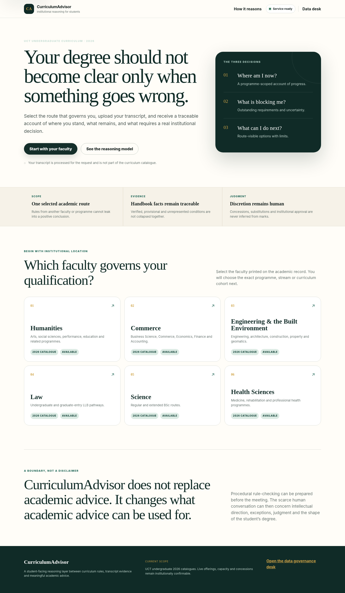
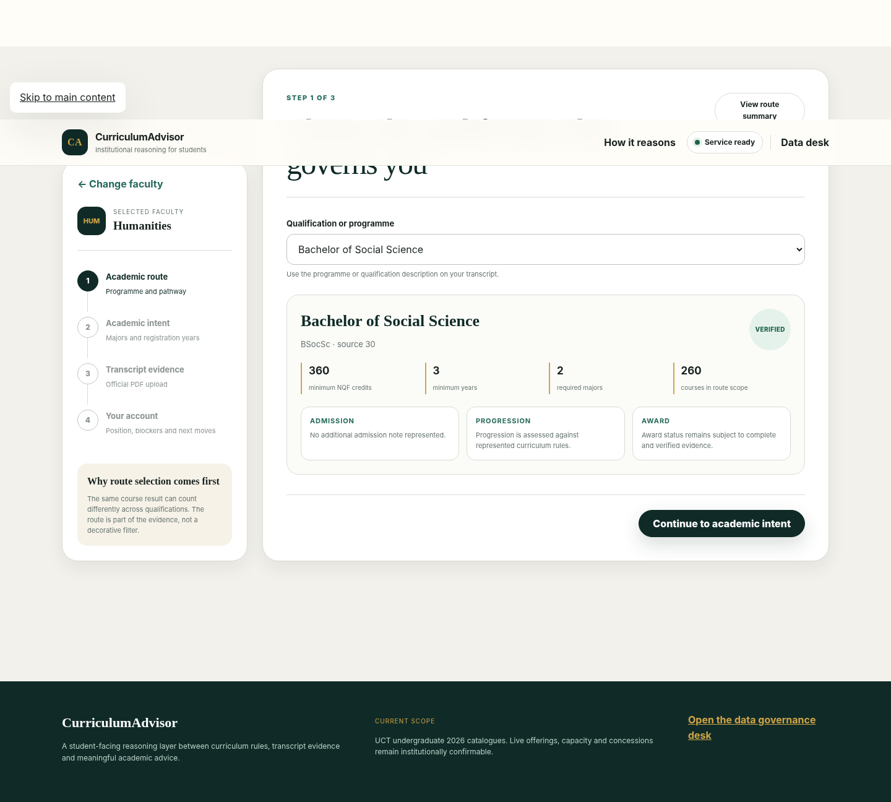
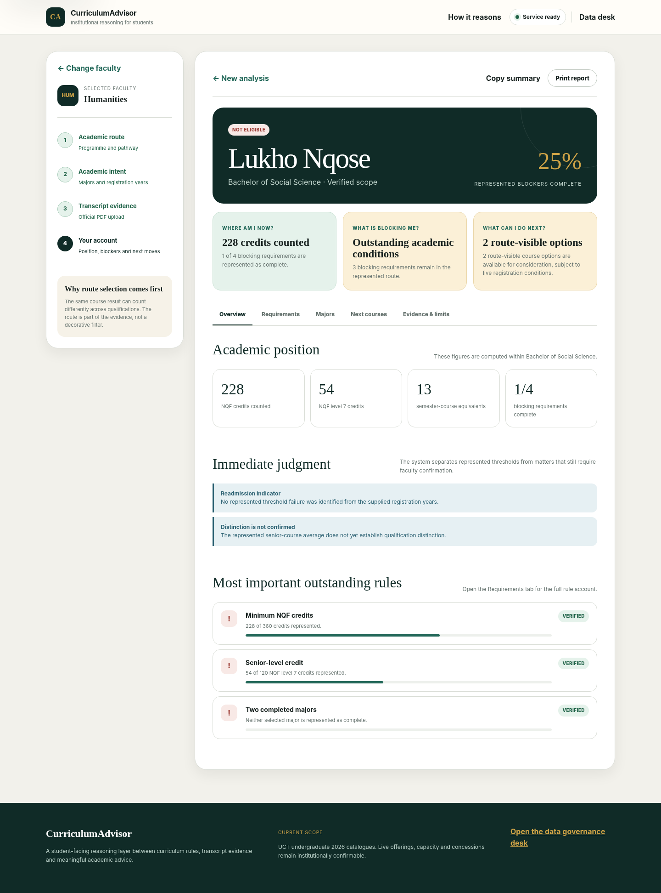
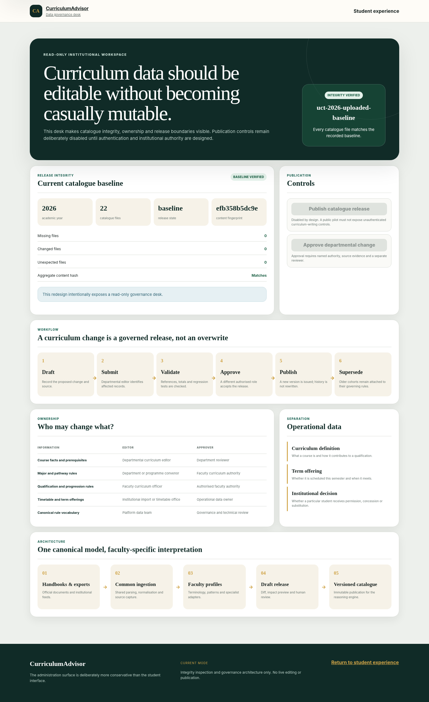

# CurriculumAdvisor — institutional reasoning for students

CurriculumAdvisor is a programme-scoped academic reasoning system for UCT undergraduate curricula. It does not merely calculate credits. It separates four things that universities often allow students to encounter as one confusing mass:

1. **transcript facts** — attempts, marks, grades and programme text;
2. **curriculum rules** — what the selected qualification, pathway and major require;
3. **computed conclusions** — what follows from represented rules and evidence;
4. **institutional judgment** — concessions, substitutions, capacity, placement evidence and discretionary decisions that cannot honestly be inferred.

The product is organised around three student questions:

- **Where am I now?**
- **What is blocking me?**
- **What can I do next?**



## What this redesign changes

The previous interface behaved primarily like a catalogue attached to a transcript upload. The redesigned product is a decision workspace:

- faculty and programme selection are treated as evidence, not decorative filters;
- the route is prepared before the transcript enters the reasoning process;
- the report presents position, blockers and next options before technical detail;
- completion and verification are shown separately;
- timetable, capacity and institutional discretion remain visibly outside the curriculum engine;
- the public administration surface is read-only until authentication and institutional authority exist;
- all new API routes are versioned under `/api/v1`;
- legacy routes remain available for compatibility.





## Product architecture

```text
Student experience                 Read-only data desk
/static/index.html                 /static/admin.html
          │                                │
          └────────── /api/v1 ─────────────┘
                         │
              FastAPI compatibility façade
              legacy routes remain active
                         │
          product + governance orchestration
              /curriculum_advisor
                         │
      programme scope + reasoning + simulation
                     /engine
                         │
       immutable 2026 catalogue JSON releases
                      /data
                         │
        manifests, schemas and draft templates
                  /governance
```

This is a **modular monolith**, intentionally. The domain does not yet justify distributed services. Academic conclusions must remain testable in one process and one release.

See [Architecture](docs/ARCHITECTURE.md) and [Product decisions](docs/PRODUCT_DECISIONS.md).

## Enabled faculties

- Humanities
- Commerce
- Engineering & the Built Environment
- Law
- Science
- Health Sciences

The existing catalogue and reasoning data are preserved. The redesign does not rewrite handbook facts or relocate faculty JSON files.

## Run locally

```bash
python -m pip install -r requirements.txt
python -m uvicorn app:app --reload
```

Open:

- student experience: `http://127.0.0.1:8000`
- read-only data desk: `http://127.0.0.1:8000/admin`
- shallow liveness: `http://127.0.0.1:8000/health`
- catalogue readiness: `http://127.0.0.1:8000/ready`
- API documentation: `http://127.0.0.1:8000/docs`

## Test and audit

```bash
python -m pip install -r requirements-dev.txt
python -m pytest -q
python -m ruff check app.py curriculum_advisor catalogue_governance tools/catalogue_guard.py tests/test_product_redesign.py
python -m bandit -q -c pyproject.toml -r app.py curriculum_advisor engine
python -m pip_audit -r requirements.txt
```

Validated in this build:

- **200 tests passed**;
- **19 subtests passed**;
- JavaScript syntax checks passed;
- Python compilation passed;
- Ruff passed for the application, governance and redesigned product surface;
- Bandit passed with documented false-positive exclusions;
- all **22 catalogue files** match the recorded baseline manifest;
- the source-data directory was not modified.

`pip-audit` requires access to its vulnerability service. It is included in CI but could not complete in the offline build environment.

## API shape

Preferred versioned endpoints:

- `GET /api/v1/bootstrap`
- `GET /api/v1/system/health`
- `GET /api/v1/system/ready`
- `GET /api/v1/faculties`
- `GET /api/v1/faculties/{faculty_key}`
- `GET /api/v1/programme`
- `GET /api/v1/catalogue`
- `GET /api/v1/majors`
- `POST /api/v1/analyse`
- `POST /api/v1/analyse/text`
- `POST /api/v1/analyse/json`
- `POST /api/v1/simulate/*`
- `POST /api/v1/goals`
- `GET /api/v1/governance/status`

The former unversioned routes are retained so deployment does not break existing clients.

## Data governance position

Departments should be able to edit curriculum **content** without redefining the canonical meaning of courses, credits, requirements or evidence states.

The intended model is:

- distributed content ownership;
- central schema governance;
- separate editor and approver roles;
- immutable annual releases;
- cohort-aware curriculum versions;
- separate term-specific timetable data;
- explicit manual-confirmation boundaries for discretion.

The `/admin` experience demonstrates this model but cannot publish or mutate curriculum data.



## Deployment

Railway is configured to:

- install from `requirements.txt`;
- start Uvicorn on the platform-provided `$PORT`;
- trust forwarded proxy headers;
- use one worker while rate limiting and caches are process-local;
- check `/ready`, which loads all enabled faculty catalogues.

See [Deployment and migration](docs/DEPLOYMENT_AND_MIGRATION.md).

## Provenance caution

This redesign was built from the locally supplied governance candidate. Its catalogue files match the recorded baseline, but the candidate records that the uploaded source archive did not match the separately supplied public-release archive checksum. That provenance warning is preserved in `governance/releases/source_archive_verification.json` and has not been erased or reinterpreted.

## Governing principle

> No architectural improvement is acceptable if it makes the academic conclusion less traceable, less reversible or more authoritative than its evidence permits.
