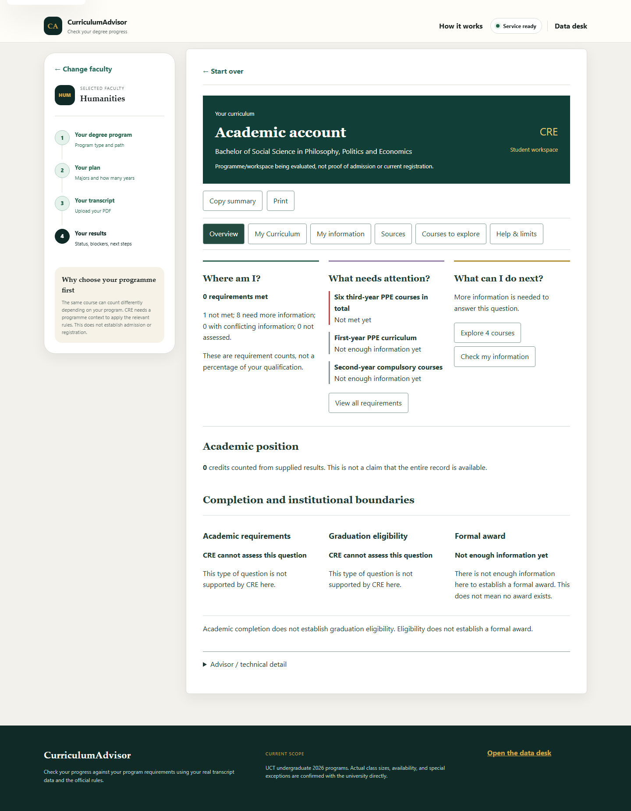
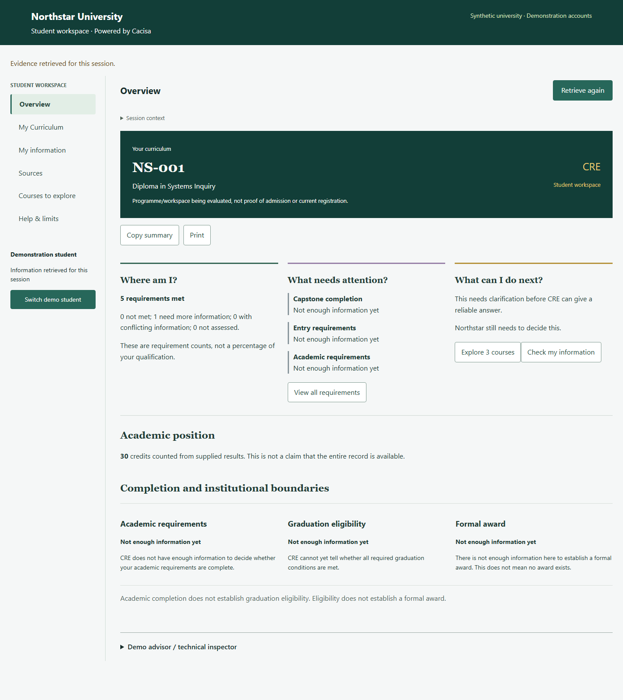

# Curriculum Reasoning Engine (CRE)

CRE is a governed institutional reasoning engine for curriculum. It is designed to explain how represented institutional rules apply to student evidence while preserving uncertainty, source traceability and institutional authority boundaries.

Cacisa Systems is the broader product/company context. Curriculum Reasoning Engine (CRE) is the curriculum reasoning product/engine in this repository. **CurriculumAdvisor** remains the UCT interface and compatibility name in existing code; package names have not been renamed.

## Current product

UCT and Northstar share a student workspace: **Overview**, **My Curriculum**, **My information**, **Sources**, **Courses to explore** where supported, **Help / Limits**, and copy/print where supported. The workspace explains the student's position, why, and available next actions, with rule and evidence disclosures kept separate.

> Personalize the application of policy without privatizing the policy itself.

Student-specific meaning is personalized; the institutional rule remains public, its source inspectable where linked, and institutional authority external. Institution-specific entry does not mean institution-specific reasoning. Generic product architecture does not require identical institutional workflows.

## Architecture

```text
Institution-specific entry / evidence acquisition
        ↓
InstitutionRelease + represented curriculum data and provenance
        ↓
Existing Report / reasoning pipeline
        ↓
StudentReasoningView (and advisor projection)
        ↓
Shared CRE Student Workspace
        ↓
Student / advisor-facing explanation
```

This is a modular monolith. UCT uses governed catalogue packages; Northstar uses an explicitly synthetic reference package, not an institutionally approved release. The engine produces assessments; product projections and the shared frontend explain them. Advisor/technical inspectors are not an advisor authorization system. See [current architecture](docs/CURRENT_ARCHITECTURE.md) for physical paths and compatibility boundaries.

## UCT demonstrator

The repository contains a working UCT demonstrator covering undergraduate curriculum material across the represented faculty packages. Faculty/programme selection precedes uploaded, manual or empty-entry analysis. Development reviews also use synthetic/constructed evidence. **Live UCT student records are not retrieved.**

```text
UCT faculty/programme/manual/upload entry → CRE → Shared Student Workspace
```

Implemented coverage does not mean every faculty, programme or rule has undergone human fidelity review.



## Northstar reference institution

Northstar University is a synthetic reference institution used to test portability, evidence boundaries, institutional separation and the shared student product experience. Its opaque course codes, explicit periods and separate achievement scale exercise materially non-UCT semantics by design.

```text
Northstar Identity → Northstar Records → Northstar Evidence Adapter
        → CRE → Shared Student Workspace
```

Northstar is an executable demonstration with synthetic institutional records and demo identity/record retrieval, not merely a test fixture. It contains no real student data and is not a production integration or authentication service. The separate test-only Northstar package remains an independent regression fixture. See [Northstar](northstar/README.md).



## What works today

- Shared reasoning contracts exercised through UCT and a materially different synthetic institution.
- Distinct known shortfall, unresolved, conflict and unsupported assessments; explicit recognition evidence and represented progression policies.
- Separate academic completion, graduation eligibility and formal award evidence boundaries; entry eligibility does not establish admission.
- Evidence receipts and scoped coverage, with receipt distinguished from use by a conclusion.
- Traceable direct, inherited and package-level rule sources, separated from student-evidence references; missing source detail stays visible.
- Shared student presentation and Northstar's synthetic identity-to-record-to-analysis flow.

These are **implemented and regression-tested capabilities**, not institutionally validated advice or complete coverage of all institutional policy.

## What CRE does not claim

CRE does not aim to become a durable student system of record. Authoritative institutional records and formal decisions remain with the institution.

This repository does not claim institutional approval, official academic advising status, live UCT SIS integration, production authentication, formal admission or registration decisions, complete source fidelity across represented UCT rules, or complete PPE fidelity beyond reviewed scope. Copy/print is reasoning output, not an official academic record. Student comprehension has not yet been validated with real users.

## Run locally

From the repository root, with Python installed (CI uses Python 3.13):

```bash
python -m pip install -r requirements.txt
python -m uvicorn app:app --reload
```

- UCT: [http://127.0.0.1:8000/](http://127.0.0.1:8000/)
- Northstar: [http://127.0.0.1:8000/northstar](http://127.0.0.1:8000/northstar); choose a listed synthetic account and use demo code `northstar-demo`.
- Administration: [http://127.0.0.1:8000/admin](http://127.0.0.1:8000/admin), read-only by default; guarded Tier 1 metadata overlays can be enabled separately. This is not institutional publishing approval.
- Operations: `/health`, `/ready`; API reference: `/docs`.

The UCT/product APIs use `/api/v1`, with legacy aliases retained. Northstar uses `/api/northstar/*`. See [running and validation](docs/RUNNING_AND_VALIDATION.md) for tests, release checks and deployment configuration.

## Validation and provenance

Validation includes the full pytest suite, focused product tests, Chromium desktop/mobile journeys, scoped Ruff/Bandit checks and the UCT release/governance gate. Exact counts belong in dated review reports, not a standing product claim.

```bash
python -m pip install -r requirements-dev.txt
python -m playwright install chromium
python -m pytest -q
python -m catalogue_governance --institution uct --release uct-2026-uploaded-baseline --json
```

Node.js must also be available on `PATH` for executable JavaScript tests. On Linux, CI installs Chromium with `--with-deps`. The full release gate runs pytest again; see the validation guide before duplicating expensive checks.

The accepted UCT baseline passes the technical gate **with warnings**, preserving `checksum_mismatch_unverified_source_archive` and missing-declaration limitations. Institutional approval is **NOT_ASSESSED**. Technical reproducibility/gate success does not establish institutional source verification. See [governance status and limits](docs/CURRENT_LIMITATIONS.md).

## Documentation map

- [Documentation index and authority hierarchy](docs/README.md)
- [Current architecture and compatibility layers](docs/CURRENT_ARCHITECTURE.md)
- [Shared Student Workspace v1](docs/SHARED_STUDENT_WORKSPACE_V1.md) and [Policy Legibility & Action Language v1](docs/CRE_POLICY_LEGIBILITY_V1.md): accepted bounded implementation/review records
- [Northstar reference institution](northstar/README.md)
- [Running, workflows and artifact guidance](docs/RUNNING_AND_VALIDATION.md)

Older architecture plans, build reports and redesign screenshots are labelled historical and retained in place. They are not current setup instructions or proof of current capabilities.

## Current limitations

The PPE aggregate third-year count remains under semantic review. Formal admission decisions, course-registration/co-requisite semantics and qualification classification/taxonomy remain source-blocked. Represented prerequisites/course exploration do not guarantee registration. Full scope and source qualifications are in [current limitations](docs/CURRENT_LIMITATIONS.md).
